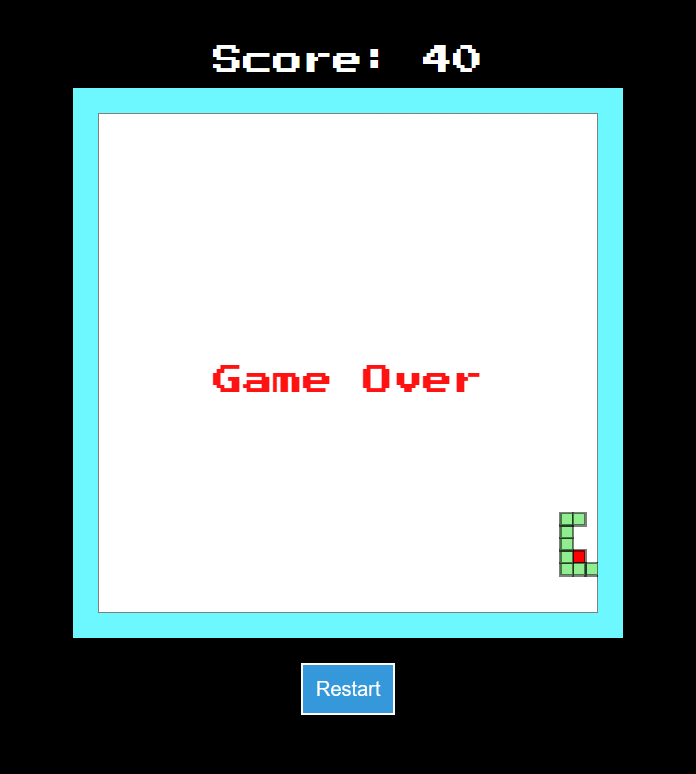

# Snake Game

A classic Snake Game implemented in HTML, CSS, and JavaScript. Play the retro-style game and see how long you can grow your snake without colliding with walls or yourself!

## Features

- Responsive design: Play on both desktop and mobile devices.
- Retro pixel art: Enjoy a nostalgic gaming experience with a pixelated snake.
- Score tracking: Keep track of your score as you eat food and grow longer.
- Game Over animation: Experience a blink animation with a "Game Over" message when the game ends.
- Restart functionality: Restart the game with a click of a button.

## How to Play

- Use the arrow keys (Up, Down, Left, Right) to control the snake's direction.
- Collect red food items to grow longer and increase your score.
- Avoid collisions with the walls and the snake's body.
- The game ends when the snake collides with itself or the game borders.

## Preview



## Getting Started

To run the game locally, follow these steps:

1. Clone the repository:

```bash
git clone https://github.com/your-username/snake-game.git
